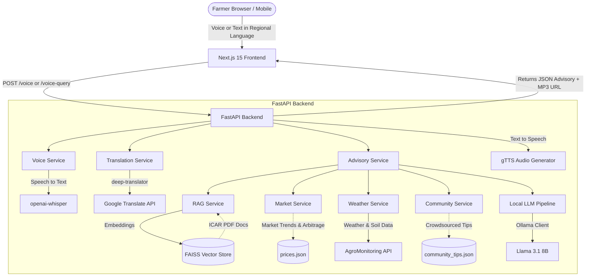

# Krishi-Setu — An Agricultural Advisory Platform

<div align="center">

**An AI-powered farming assistant that speaks your language.**

*Voice Queries • Market Intelligence • Weather Insights • Community Knowledge • Multilingual*

[](https://python.org)
[](https://fastapi.tiangolo.com)
[](https://nextjs.org)
[](https://ollama.com)
[](LICENSE)

</div>

---

## 📋 Table of Contents

- [Overview](#overview)
- [Architecture](#architecture)
- [Tech Stack](#tech-stack)
- [Features](#features)
- [Setup Instructions](#setup-instructions)
- [Environment Variables](#environment-variables)
- [API Endpoints](#api-endpoints)
- [Project Structure](#project-structure)
- [Contributors](#contributors)

---

## Overview

**Krishi-Setu** (meaning *Agriculture Bridge* in Sanskrit) is a full-stack AI advisory platform designed specifically for Indian farmers. It bridges the gap between farmers and modern agricultural knowledge using:

- **Voice Interaction** — Farmers speak in their regional language; the app transcribes, answers, and reads the response back aloud
- **Llama 3.1 8B (via Ollama)** — Local LLM generates expert crop advisory with DO/DON'T guidance
- **RAG Pipeline** — FAISS vector store indexes ICAR knowledge documents for context-aware, citation-backed answers
- **Market Intelligence** — Real-time price lookup, multi-market arbitrage analysis, and AI-powered demand forecasting
- **Weather Integration** — Live weather and soil data via AgroMonitoring API + OpenStreetMap geocoding
- **Community Knowledge Network** — Shared farmer tips surfaced via semantic search
- **9-Language Support** — English, Hindi, Tamil, Telugu, Kannada, Marathi, Punjabi, Gujarati, Bengali

---

## Architecture

The system is designed with a decoupled frontend and backend, using a microservices-inspired architecture within FastAPI to handle distinct domains (advisory, market, weather, voice). 



### Component Details
1. **Frontend**: A Next.js 15 application utilizing the Web Audio API to record voice directly in the browser. It manages global state for 9 languages and dynamically translates all UI elements and outgoing queries.
2. **Translation Layer**: Intercepts incoming queries (voice or text), translates them to English for the LLM pipeline, and translates the generated English response back to the user's native language.
3. **Context Aggregation (Advisory Service)**: Before calling the LLM, the system aggressively gathers context. It queries FAISS for agricultural knowledge, the AgroMonitoring API for live weather, and local JSON stores for market prices, arbitrage opportunities, and community tips. 
4. **Local LLM**: Passes the aggregated context via a strict system prompt to `llama3.1:8b` via Ollama, ensuring offline capability, low latency, and highly structured DO/DON'T responses.

---

## Tech Stack

| Layer | Technology |
|-------|-----------|
| **Frontend** | Next.js 15, TypeScript, Tailwind CSS v4, Shadcn UI, Lucide Icons, Outfit (Google Fonts) |
| **Backend** | Python, FastAPI, Uvicorn, Pydantic |
| **AI / LLM** | Llama 3.1 8B via Ollama (local, offline-capable) |
| **RAG** | LangChain, FAISS, `sentence-transformers` (`all-MiniLM-L6-v2`) |
| **Voice** | `openai-whisper` (STT), gTTS (TTS), Web Audio API |
| **Weather** | AgroMonitoring API, Open-Meteo, OSM Nominatim (geocoding) |
| **Translation** | `deep-translator` (Google Translate wrapper) |

---

## Features

### ✅ Voice Advisory (Multilingual)
- 🎙️ Hold-to-speak mic — records audio, transcribes with **Whisper**, generates advice with **Llama 3.1**
- 🔊 Text-to-speech reply via **gTTS** — plays audio response back in farmer's language
- Text input alternative for typed queries

### ✅ RAG-Backed ICAR Knowledge
- ICAR agricultural documents indexed into a **FAISS** vector store
- Semantic retrieval provides citations (e.g., `farmerbook (Page 3)`) alongside every answer
- Answers include structured **DO** and **DON'T** guidance

### ✅ Market Intelligence & Demand Forecasting
- Live crop price lookup across 19+ crops with market source
- Multi-market **arbitrage analysis** — compares local vs. best available market price
- Net gain calculation after estimated transport cost
- **Demand Forecast** badge per crop (High / Stable / Low) with visual indicators
- AI trend signal: Rising, Stable, or Falling
- **Sell Now / Wait** recommendation powered by market trend + arbitrage

### ✅ Live Weather & Soil Data
- City-based weather lookup (temperature, humidity, condition)
- **Soil moisture** and **soil temperature** via AgroMonitoring API
- Auto-detects user location via browser geolocation

### ✅ Community Knowledge Network
- 50+ crowdsourced farmer tips stored in `community_tips.json`
- Semantic search surfaces the most relevant tips for each query
- Displayed with upvote counts and farmer location tags

### ✅ Full Internationalization (9 Languages)
- Language switcher in the UI header
- All UI labels, loading steps, market insight labels, section titles, and demo queries translate instantly
- Input/output language also changes — queries and AI responses match the selected language

### ✅ Demo Mode
- 8 one-tap demo query chips covering disease, irrigation, market selling, community tips, weather impact, and heat/rain advisories
- All demo queries fully translated per language

---

## Setup Instructions

### Prerequisites

- **Python 3.10+** ([download](https://python.org))
- **Node.js 18+** ([download](https://nodejs.org))
- **Ollama** ([download](https://ollama.com)) — for the local LLM
- **Git** ([download](https://git-scm.com))
- **FFmpeg** — required by `pydub` for audio processing ([download](https://ffmpeg.org/download.html))

---

### 🤖 LLM Setup (Ollama)

After installing Ollama, pull the model:

```bash
ollama pull llama3.1:8b
```

Start the Ollama server (it usually starts automatically):
```bash
ollama serve
```

---

### 1. Clone the Repository

```bash
git clone https://github.com/Vigneshwaran-NM/KrishiSetu-An-agricultural-advisory-platform.git
cd KrishiSetu-An-agricultural-advisory-platform
```

---

### 2. Backend Setup

```bash
cd backend
python -m venv venv

# Windows
venv\Scripts\activate

# macOS / Linux
source venv/bin/activate

pip install -r requirements.txt
```

> **Note:** The first run downloads the `all-MiniLM-L6-v2` model and builds the FAISS vector store from documents in `data/rag/`. This may take a few minutes.

Start the backend:

```bash
uvicorn main:app --port 5000 --reload
```

---

### 3. Frontend Setup

```bash
cd frontend
npm install
```

Create `frontend/.env.local`:

```env
NEXT_PUBLIC_BACKEND_URL=http://localhost:5000
```

Start the frontend:

```bash
npm run dev
```

---

### 4. Open in Browser

Navigate to **`http://localhost:3000`**

> For voice features, use **Google Chrome** or **Microsoft Edge**.

---

### 5. Access on Mobile (Same Wi-Fi)

1. Find your PC's local IP: run `ipconfig` (Windows) — note the IPv4 address (e.g., `192.168.1.10`)
2. Update `NEXT_PUBLIC_BACKEND_URL` in `.env.local` to `http://192.168.1.10:5000`
3. Start servers with network binding:
   ```bash
   # Backend
   uvicorn main:app --port 5000 --host 0.0.0.0

   # Frontend — add -H flag in package.json dev script
   next dev -H 0.0.0.0
   ```
4. Open `http://192.168.1.10:3000` on your phone

---

## Environment Variables

| Variable | Description | Default |
|----------|-------------|---------|
| `NEXT_PUBLIC_BACKEND_URL` | FastAPI backend URL | `http://localhost:5000` |
| `AGRO_API_KEY` | AgroMonitoring / OpenWeatherMap API key | Set in `backend/config.py` |

> **Get AgroMonitoring key:** Register at [agromonitoring.com](https://agromonitoring.com)

---

## API Endpoints

| Method | Endpoint | Description |
|--------|----------|-------------|
| `GET` | `/health` | Service health check (Ollama + API status) |
| `POST` | `/voice` | Upload audio → Whisper STT → LLM advisory → gTTS audio |
| `POST` | `/voice-query` | Text query + language → LLM advisory (translated) |
| `GET` | `/price?crop=tomato` | Market price + trend + demand forecast for a crop |
| `GET` | `/weather?city=Madurai` | Live weather + soil data for a city |

### Example: Voice Query

```bash
curl -X POST http://localhost:5000/voice-query \
  -H "Content-Type: application/json" \
  -d '{"text": "My tomato leaves have brown spots", "target_lang": "en"}'
```

**Response:**
```json
{
  "advice": "DO: Apply copper-based fungicide...\nDON'T: Water the leaves directly...",
  "price": { "crop": "tomato", "modal_price": 2400, "trend": "high", "market": "Madurai" },
  "weather": { "city": "Madurai", "temperature": 34.2, "humidity": 65, "condition": "Clear" },
  "sources": ["farmerbook (Page 3)", "icar_guide (Page 11)"],
  "market_insight": { "sell_now": true, "trend": { "label": "Rising", "forecast": "Prices expected to rise" } },
  "community_tips": [{ "tip": "Spray neem oil early morning...", "upvotes": 42 }]
}
```

---

## Project Structure

```
KrishiSetu/
|-- backend/                          # FastAPI Python backend
|   |-- config.py                     # API keys, model config, paths
|   |-- main.py                       # FastAPI app + router registration
|   |-- models.py                     # Pydantic request/response models
|   |-- ollama_client.py              # Llama 3.1 inference via Ollama
|   |-- requirements.txt              # Python dependencies
|   |-- routes/
|   |   |-- health.py                 # GET /health
|   |   |-- price.py                  # GET /price
|   |   |-- voice.py                  # POST /voice (audio STT->TTS)
|   |   |-- voice_query.py            # POST /voice-query (text)
|   |   |-- weather.py                # GET /weather
|   |-- services/
|   |   |-- advisory_service.py       # Main LLM pipeline (RAG + Ollama)
|   |   |-- community_service.py      # Semantic tip retrieval
|   |   |-- market_service.py         # Arbitrage + demand forecasting
|   |   |-- price_service.py          # Price data lookup
|   |   |-- rag_service.py            # FAISS vector retrieval
|   |   |-- translation_service.py    # deep-translator wrapper
|   |   |-- voice_service.py          # Whisper STT + gTTS TTS
|   |   |-- weather_service.py        # AgroMonitoring + OSM geocoding
|   |-- rag/
|   |   |-- embeddings.py             # Sentence-transformer model
|   |   |-- indexer.py                # FAISS index builder
|   |   |-- retriever.py              # Semantic document retrieval
|   |-- static/audio/                 # Generated TTS audio files (runtime)
|
|-- frontend/                         # Next.js 15 TypeScript frontend
|   |-- src/
|   |   |-- app/
|   |   |   |-- layout.tsx            # Root layout + fonts
|   |   |   |-- page.tsx              # Main page (state management)
|   |   |   |-- globals.css           # Global styles + shimmer animations
|   |   |-- components/
|   |   |   |-- AIResponseCard.tsx    # Advisory result display + reasoning panel
|   |   |   |-- ConversationHistory.tsx # Past queries list
|   |   |   |-- DemoQueries.tsx       # Quick-tap demo chip buttons
|   |   |   |-- LanguageProvider.tsx  # React context for language state
|   |   |   |-- MicButton.tsx         # Hold-to-speak recording button
|   |   |   |-- PriceCards.tsx        # Market prices + demand forecast grid
|   |   |   |-- TextInput.tsx         # Text query input bar
|   |   |   |-- WeatherCard.tsx       # Live weather display
|   |   |-- lib/
|   |       |-- translations.ts       # i18n strings for all 9 languages
|   |-- package.json
|   |-- next.config.ts
|   |-- tsconfig.json
|
|-- data/
|   |-- prices.json                   # Crop prices with demand_forecast
|   |-- market_trends.json            # Historical market trend data
|   |-- community_tips.json           # Crowdsourced farmer tips
|   |-- rag/                          # ICAR source PDFs for RAG indexing
|
|-- docs/                             # Project documentation
|-- .gitignore
|-- README.md                         # This file
```

---

## Contributors

### **Vigneshwaran N M**

🔗 [GitHub](https://github.com/Vigneshwaran-NM)
🔗 [LinkedIn](https://www.linkedin.com/in/vigneshwaran-nm)

---

### **Kanishka C M**

🔗 [GitHub](https://github.com/kani-0301)
🔗 [LinkedIn](https://www.linkedin.com/in/kanishka-c-m-812855302?utm_source=share_via&utm_content=profile&utm_medium=member_android)

---

### **Karthikeyan R**

🔗 [GitHub](https://github.com/karthikeyanramesh26-beep)
🔗 [LinkedIn](https://www.linkedin.com/in/karthikeyan-r-bb59002b2?utm_source=share_via&utm_content=profile&utm_medium=member_android)

---

### **Immanuel A**

🔗 [GitHub](https://github.com/immanueli2005-dev)
🔗 [LinkedIn](https://www.linkedin.com/in/immanuel-abraham-4b2853302?utm_source=share_via&utm_content=profile&utm_medium=member_android)

---

## License

MIT License — feel free to use, modify, and distribute.

---

<div align="center">
  <strong>Built for Indian Farmers 🌾 — Krishi-Setu bridges the knowledge gap in agriculture</strong>
</div>
